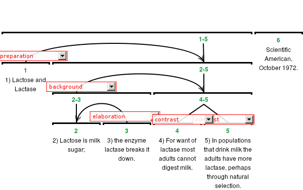
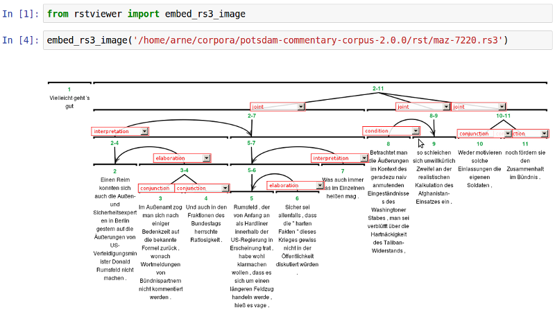

rstviewer
=========

This library allows you to convert Rhetorical Structure Theory
rs3 files into HTML pages or PNG images.

The code is heavily based on Amir Zeldes' `rstWeb`_, a web based
annotation tool for rhetorical structures.

.. _`rstWeb`: https://github.com/amir-zeldes/rstWeb

Usage
-----

``rstviewer`` can be used from the command line as well as
a Python library. Here are the command line options::

    usage: rstviewer [-h] [-f [OUTPUT_FORMAT]] rs3_file [output_file]

    Convert an RS3 file into an HTML file containing the RST tree.

    positional arguments:
      rs3_file
      output_file

    optional arguments:
      -h, --help            show this help message and exit
      -f [OUTPUT_FORMAT], --output-format [OUTPUT_FORMAT]
                            output format: html (default), png

An RS3 file can be converted into an HTML page, where the RST tree
is drawn on a canvas using Javascript/`jsPlumb <https://jsplumbtoolkit.com>`_::

	rstviewer input.rs3 output.html

To convert an RS3 file into an image of the RST tree like this one,
type::

	rstviewer -f png input.rs3 output.png

You can also use `rstviewer` as a library, e.g. to embed an RST tree
into a Jupyter notebook:

Installation
------------

To use `rstviewer` to convert rs3 files into HTML pages, clone the repo
and install it with python.

::

    git clone https://github.com/arne-cl/rstviewer.git
    cd rstviewer
    sudo python setup.py install

To generate PNG images, you will additionally need to install selenium
and PhantomJS::

    sudo apt install phantomjs
    sudo pip install selenium

Citing
------

If you're using rstviewer for a project or article, please cite Amir's original work:

| Zeldes, Amir (2016). `rstWeb - A Browser-based Annotation Interface for Rhetorical Structure Theory and Discourse Relations. <http://aclweb.org/anthology/N/N16/N16-3001.pdf>`_
| In: Proceedings of NAACL-HLT 2016 System Demonstrations. San Diego, CA, 1-5.
